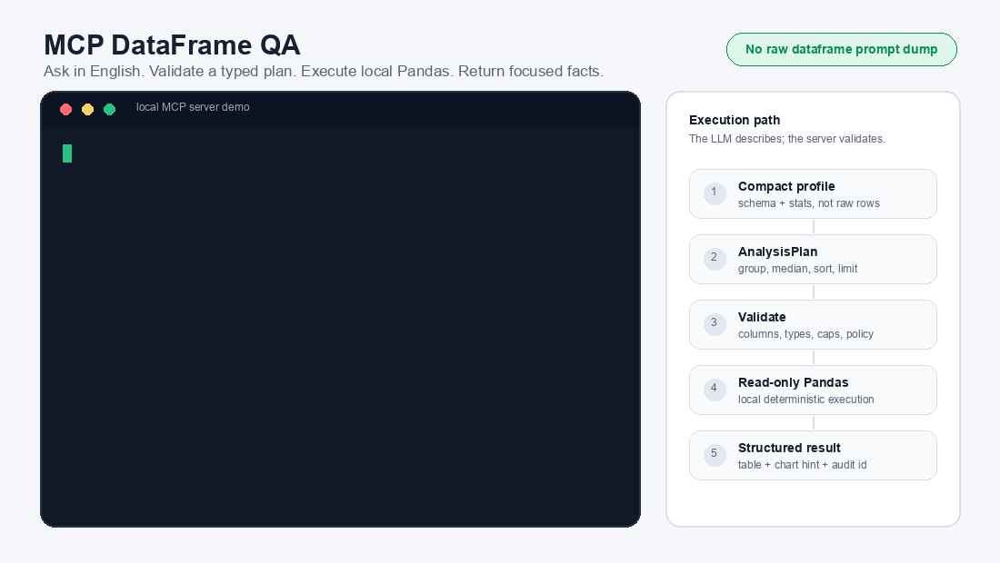

# MCP DataFrame QA

A research-informed MCP server for safe dataframe question answering over local data.

Dumping an entire dataframe into an LLM prompt for every question is an inefficient way to do analytics. It burns context window on raw rows, gets expensive quickly, forces aggressive truncation for real datasets, and can still leave the model guessing instead of calculating. The better pattern is to give the model compact schema context, let it decide what statistics are needed, execute those specific dataframe operations locally, and return the computed facts as focused context for the final answer.

**MCP DataFrame QA** implements that pattern for MCP-compatible assistants. It turns a local CSV, Parquet file, or Pandas dataframe into a natural-language analytics tool where the LLM proposes a typed analysis plan (not code) and the local server validates and executes that plan with read-only Pandas operations (plan converted to code). The dataframe stays local, the model sees profiles, plans, and results rather than the full table.

The repository ships with a prepared 91,872-row public Zillow Research housing-market dataset, so it is useful immediately after cloning while remaining small enough for GitHub and local Pandas.

The project builds on prior work in dataframe question answering, especially [DataFrame QA: A Universal LLM Framework on DataFrame Question Answering Without Data Exposure](https://arxiv.org/abs/2401.15463), and adapts those ideas to a practical, shareable MCP server.

Add an OpenAI, Anthropic, or Gemini API key, then ask questions like:

- "What are the top metros by median list price?"
- "Show average median list price by state."
- "How many metro-months had more than 10,000 active listings?"
- "What are the top markets by new listings?"

The design goal is simple: **English in, validated dataframe operations out, no arbitrary code execution by default.**

## Demo



## Highlights

- Bring your own CSV, Parquet file, or Pandas dataframe
- Ask analytical questions in natural language
- Return structured MCP results in addition to prose
- Expose schema through MCP resources instead of placing raw data in prompts
- Use OpenAI, Anthropic, or Gemini to generate typed analysis plans
- Support validated derived measures such as ratios and per-unit metrics
- Enforce read-only execution, plan validation, output caps, and cell caps
- Return audit IDs for every query, with optional JSONL audit logs
- Keep the MCP tool surface small, composable, and easy for models to use

## Dataset Included

The default dataframe is `data/zillow_metro_market.csv`, prepared from public [Zillow Research Housing Data](https://www.zillow.com/research/data/) for-sale listing time series. It combines monthly metro-level and U.S.-level metrics for:

- for-sale inventory
- new listings
- median list price

The prepared table has 91,872 rows, 11 columns, 928 geographies, and month-end observations from 2018-03-31 through 2026-05-31. The CSV is approximately 6.6 MB.


To rebuild the dataset from Zillow Research source CSVs:

```bash
python scripts/prepare_zillow_market_data.py
```

See [`data/zillow_metro_market.README.md`](data/zillow_metro_market.README.md) for source URLs, transformation details, and column definitions.

## Why This Exists

The DataFrame QA paper demonstrates that language models can answer dataframe questions by generating analytical queries from dataframe structure, while avoiding direct exposure of the full dataset to the model. That observation is the foundation of this project.

A reusable MCP server, however, has additional engineering requirements: explicit tool schemas, client-visible resources, output validation, execution limits, auditability, and safe defaults for users who clone the repository and bring their own data. This project focuses on that implementation layer.

This repository adopts the following approach:

1. The assistant sees a compact dataframe profile, not your full dataset.
2. Natural language is translated into a typed analysis plan.
3. The plan may include derived numeric measures, represented as JSON expression trees rather than Python code.
4. The plan is validated against the dataframe schema, type rules, and guardrails.
5. A deterministic read-only executor runs the approved dataframe operations.
6. Results are returned as structured MCP content plus a concise human-readable answer.

The result is a reusable MCP server for dataframe analytics with explicit production-oriented mechanisms: typed schemas, read-only execution, derived-measure validation, output caps, audit IDs, optional audit logs, and clear MCP resources/tools/prompts. The allowed operations on the dataframe can be modified by the user by adding them to schema.py.

## Research Context

This project is motivated by three converging lines of work.

First, dataframe question answering research shows that tabular analysis can be mediated through generated queries rather than full data disclosure. The DataFrame QA framework is particularly relevant because it frames dataframe QA as schema-aware query generation with safe execution.

Second, recent table-QA systems increasingly use multi-stage pipelines: schema understanding, query generation, execution, answer extraction, and refinement. For example, [Agentic LLMs for Question Answering over Tabular Data](https://arxiv.org/abs/2509.09234) reports a natural-language-to-SQL pipeline with verification and iterative refinement for tabular QA.

Third, MCP literature and practice are converging on small, typed, auditable tool surfaces. [MCP Server Architecture Patterns for LLM-Integrated Applications](https://arxiv.org/abs/2606.30317) identifies recurring server patterns such as Resource Gateway, Tool Orchestrator, and Domain-Specific Adapter. MCP DataFrame QA is closest to a Domain-Specific Adapter with Resource Gateway behavior: it exposes dataset profiles as resources and analysis operations as a small number of structured tools.

The contribution of this repository is not a new benchmark result. It is a careful systems design for making dataframe QA easy to clone, inspect, run, and adapt within the MCP ecosystem.

Relative to research prototypes and notebook-oriented dataframe agents, this repository emphasizes:

- a packageable MCP server interface
- explicit resources for dataset profiles
- stable input and output schemas
- a typed intermediate analysis representation
- deterministic read-only execution
- local dataframe execution. The only network call in the local chatbot is the selected LLM provider request
- audit records and result-size controls

## Quick Start

```bash
git clone https://github.com/sindhug/mcp-dataframe-qa.git
cd mcp-dataframe-qa
uv sync
cp .env.example .env
```

Open `.env` and set one provider:

```bash
LLM_PROVIDER=openai
OPENAI_API_KEY=sk-your-key
```

Then run the model-backed local chatbot:

```bash
uv run mcp-dataframe-chat --question 'What are the top metros by median list price?'
```

That command launches the MCP server locally over stdio, sends one question through
an OpenAI, Anthropic, or Gemini planner, executes the validated plan through MCP,
and prints the structured table result.

To start the MCP server for an MCP-compatible client:

```bash
uv run mcp-dataframe-qa
```

You can also verify the local engine before connecting an MCP client:

```bash
uv run mcp-dataframe-qa --profile
uv run mcp-dataframe-qa --ask 'What are the top metros by median list price?'
```

For an interactive chatbot loop:

```bash
uv run mcp-dataframe-chat
```

Or ask one question and exit:

```bash
uv run mcp-dataframe-chat --question 'How many metro-months had more than 10,000 active listings?'
```

For offline development without an LLM key, the deterministic planner remains available:

```bash
uv run mcp-dataframe-chat --planner heuristic --question 'What are the top metros by median list price?'
```

That fallback is useful for testing the executor and MCP plumbing, but the main chatbot path is model-backed.

### API Key Configuration

The local chatbot reads `.env` automatically. Set exactly one provider key:

```bash
# .env
LLM_PROVIDER=openai      # openai, anthropic, or gemini

OPENAI_API_KEY=
OPENAI_MODEL=gpt-5.4-mini

ANTHROPIC_API_KEY=
ANTHROPIC_MODEL=claude-sonnet-4-5

GEMINI_API_KEY=
GEMINI_MODEL=gemini-2.5-flash
```

You can also pass values at runtime:

```bash
uv run mcp-dataframe-chat \
  --provider anthropic \
  --model claude-sonnet-4-5 \
  --api-key "$ANTHROPIC_API_KEY"
```

The dataframe stays local. The model receives the compact dataframe profile,
column metadata, and user question so it can produce an `AnalysisPlan`; it does
not receive the full CSV.

Example local MCP configuration:

```json
{
  "mcpServers": {
    "dataframe-qa": {
      "command": "uv",
      "args": [
        "run",
        "mcp-dataframe-qa",
        "--data",
        "/absolute/path/to/your/data.csv"
      ]
    }
  }
}
```

## Using Your Own Dataset

There are two ways to point this at your own data. A quick one-off query with no
setup, or a configured dataset with column descriptions that make the planner's
answers noticeably better. Both start the same way, by looking at what you actually
have.

**1. Profile the file first.**

```bash
uv run mcp-dataframe-qa --data ~/Downloads/my_data.csv --profile
```

This loads the file and prints every column's dtype, null count, summary stats, and
top values. No LLM call, no config required. Use it to see what you're working with
before writing anything down.

**2. Generate a starter config.**

```bash
uv run mcp-dataframe-qa --data ~/Downloads/my_data.csv --init-config
```

This writes `dataframe_qa_my_data.yaml` with every column already listed under its
real name, a guessed `semantic_type` where the column name makes it obvious (a column
ending in `_id` becomes `identifier`, a column named `price` becomes `currency`), and
blank `description` and `synonyms` fields for you to fill in. A wrong guess is worse
than no guess, so ambiguous numeric columns are left blank instead of labeled with a
false-confidence type. Pass `--out <path>` to control the filename.

Open the generated file and fill in the descriptions. That's the only manual step:

```yaml
columns:
  status:
    description: Whether the listing is active, pending, or sold
    semantic_type: dimension
    synonyms: [listing status, availability]
```

**3. Use it.**

```bash
uv run mcp-dataframe-chat --config dataframe_qa_my_data.yaml
uv run mcp-dataframe-qa --config dataframe_qa_my_data.yaml --ask "your question"
```

If a config's columns and the actual dataframe's columns ever drift apart, a renamed
column, a config copied from a different dataset, both tools print a warning naming
exactly which columns are affected, instead of silently answering with half the
schema missing.

**Skipping the config entirely.** `mcp-dataframe-qa --data <path>` works with no
config at all, and is the fastest way to try a file:

```bash
uv run mcp-dataframe-qa --data ~/Downloads/my_data.csv --ask "your question"
```

The tradeoff: with no `columns:` section, the planner only has column names and raw
sample values to work with, not descriptions or synonyms, so it will sometimes miss
what you mean. `mcp-dataframe-chat` does not accept `--data` directly since it always
talks to a specific configured dataset. Point it at a config with `--config` instead,
even a minimal one with just a `dataset:` block and no `columns:` section.

**Example of a fully annotated config**, the one this repo ships with:

```yaml
# dataframe_qa.yaml
dataset:
  id: default
  path: data/zillow_metro_market.csv
  table_name: zillow_metro_market

limits:
  max_rows_returned: 100
  max_execution_ms: 3000
  max_cell_chars: 500

columns:
  region_name:
    description: Metro or national region name
    semantic_type: dimension
    synonyms: [metro, market, region, msa]
  state_name:
    description: State abbreviation for the metro area
    semantic_type: dimension
    synonyms: [state, state code]
  for_sale_inventory:
    description: Count of unique listings active at any time during the month
    semantic_type: count
    synonyms: [inventory, active listings, homes for sale]
  median_list_price:
    description: Median listed price in USD
    semantic_type: currency
    synonyms: [median price, list price, asking price, price]
```

## What You Get

### Local Chatbot

`mcp-dataframe-chat` is a terminal chatbot that starts the MCP server over stdio,
reads the dataframe profile from `dataframe://default/profile`, asks the selected
LLM provider to produce an `AnalysisPlan`, and executes that plan through the
`execute_analysis_plan` MCP tool.

Supported providers:

- OpenAI through the Responses API
- Anthropic through the Messages API
- Gemini through the GenerateContent API

### MCP Resources

Resources expose dataset context without dumping raw data into the model.

```text
dataframe://default/profile
dataframe://default/columns
dataframe://default/examples
```

### MCP Tools

The public tool surface stays intentionally small.

```python
query_dataframe(question: str, dataset_id: str = "default") -> StructuredResult
execute_analysis_plan(plan: AnalysisPlan, dataset_id: str = "default") -> StructuredResult
preview_dataframe(dataset_id: str = "default", limit: int = 20) -> StructuredResult
```

`query_dataframe` is the ergonomic entry point. `execute_analysis_plan` is the stable core. `preview_dataframe` is capped and meant for orientation, not data export.

### MCP Prompts

Prompts make common workflows discoverable in clients that support them.

```text
ask_dataframe
explain_dataframe
```

## The Core Contract

The DataFrame QA paper studies LLM-generated Pandas queries as a general dataframe QA mechanism. MCP DataFrame QA preserves the central idea of translating natural language into executable analysis, but uses a typed intermediate representation by default.

Instead of executing arbitrary Python, the assistant produces a typed `AnalysisPlan`. The plan is data, not code: it can describe filters, derived numeric columns, group-bys, metrics, sort order, and limits.

```json
{
  "derive": [],
  "filters": [],
  "group_by": ["region_name"],
  "metrics": [
    {
      "fn": "median",
      "column": "median_list_price",
      "as": "median_list_price"
    }
  ],
  "sort": [
    {
      "column": "median_list_price",
      "direction": "desc"
    }
  ],
  "limit": 10
}
```

For questions that need custom statistics, the plan can include derived columns. For example, a price-per-square-foot question can be represented as a safe expression tree:

```json
{
  "derive": [
    {
      "name": "price_per_sqft",
      "expr": {
        "op": "divide",
        "left": { "op": "column", "column": "price" },
        "right": { "op": "column", "column": "sqft" }
      }
    }
  ],
  "filters": [],
  "group_by": ["neighborhood"],
  "metrics": [
    {
      "fn": "median",
      "column": "price_per_sqft",
      "as": "median_price_per_sqft"
    }
  ],
  "sort": [
    {
      "column": "median_price_per_sqft",
      "direction": "desc"
    }
  ],
  "limit": 10
}
```

The server validates that plan before anything runs:

- columns must exist
- derived columns must have simple, non-conflicting names
- derived expressions may use only approved JSON operators: `column`, `literal`, `add`, `subtract`, `multiply`, `divide`, and `ratio`
- arithmetic expressions must use numeric operands
- filter operators and metric functions must be allowed by the schema
- metric functions must be compatible with the referenced column type
- result limits are enforced
- long string cells are capped
- execution uses deterministic read-only Pandas operations
- no Python source code, imports, filesystem access, or network access are accepted as part of a plan
- every query receives an audit id
- optional JSONL audit logs are written only when configured
- execution time is measured and reported as a warning if it exceeds `max_execution_ms`

This plan-based layer is the main engineering adaptation. It makes the generated analysis easier to validate, explain, test, cache, and audit before execution.

### Adding Safe Operations

The allowed operations are intentionally explicit. If an analysis operation should be supported, add it to the plan contract and executor instead of asking the LLM to emit raw Pandas code.

Use this path for a new row-level expression operator:

1. Add the operation name to `ExpressionOp` in `src/mcp_dataframe_qa/schemas.py`.
2. Add validation rules in `src/mcp_dataframe_qa/validator.py`. For numeric binary operations, this usually means adding the operation to `BINARY_NUMERIC_OPS`.
3. Add the Pandas implementation in `_evaluate_expression` in `src/mcp_dataframe_qa/executor.py`.
4. Update the LLM prompt in `src/mcp_dataframe_qa/llm.py` so model-backed planners know the operation exists.
5. Add guardrail and execution tests in `tests/test_guardrails.py`.
6. Update this README if the operation changes the public plan contract.

For example, to allow a safe `power` expression:

```python
# src/mcp_dataframe_qa/schemas.py
ExpressionOp = Literal[
    "column",
    "literal",
    "add",
    "subtract",
    "multiply",
    "divide",
    "ratio",
    "power",
]
```

```python
# src/mcp_dataframe_qa/validator.py
BINARY_NUMERIC_OPS = {"add", "subtract", "multiply", "divide", "ratio", "power"}
```

```python
# src/mcp_dataframe_qa/executor.py
if expr.op == "power":
    return left**right
```

Then a planner could request:

```json
{
  "derive": [
    {
      "name": "sqft_squared",
      "expr": {
        "op": "power",
        "left": { "op": "column", "column": "sqft" },
        "right": { "op": "literal", "value": 2 }
      }
    }
  ],
  "metrics": [
    {
      "fn": "avg",
      "column": "sqft_squared",
      "as": "avg_sqft_squared"
    }
  ]
}
```

For a new aggregate such as `std`, make the same kind of change in `MetricFn`, the metric validation rules, `_compute_series`, `_compute_grouped`, the LLM prompt, and tests. For larger features such as correlation, rolling windows, joins, or date bucketing, prefer adding a new typed plan node with its own validator and executor handler rather than squeezing complex behavior into a string field.

Example structured result:

```json
{
  "answer": "Returned 10 rows. Query: What are the top metros by median list price?",
  "kind": "table",
  "value": null,
  "table": {
    "columns": ["region_name", "median_list_price"],
    "rows": [
      {
        "region_name": "Vineyard Haven, MA",
        "median_list_price": 1997667.0
      }
    ]
  },
  "chart": null,
  "warnings": [],
  "audit_id": "qry_20260709_0001"
}
```

## Design Principles

### 1. Dataframe Profile as Context

The model gets schema, column descriptions, safe samples, and summary statistics. It does not need the full dataframe to answer most analytical questions.

This follows the direction of DataFrame QA research (generate analysis from dataframe structure while minimizing dataset exposure).

### 2. Typed Plans as Execution Contracts

Generated Pandas remains a valuable research and prototyping technique. For a shareable MCP server, this project uses a typed plan as the default because it provides a narrower execution contract and clearer validation boundary.

The plan can express more than simple aggregates. Derived numeric columns are represented as JSON expression trees and executed by known-safe Pandas handlers. This gives the LLM room to request custom statistics such as ratios without giving it a live Python interpreter.

### 3. Minimal Tool Surface

MCP servers are easier for models and humans to understand when the tool list is small and composable. This project exposes a few high-leverage tools instead of a tool per dataframe operation.

### 4. Structured Results First

Every answer returns machine-readable content. The prose is there for humans, but downstream agents and apps should be able to consume the result directly.

### 5. Safe by Default, Extensible by Choice

The default path is read-only analysis. Advanced code execution, custom functions, remote data loading, and broader filesystem access are extension points rather than default features.

## Scope and Limitations

MCP DataFrame QA is designed for practical, local dataframe analysis. It intentionally does not attempt to solve every form of tabular reasoning.

- It is best suited to single-table or lightly configured dataframe workflows.
- It prioritizes deterministic aggregates, filters, sorting, grouping, derived arithmetic measures, and summaries.
- It does not replace a governed enterprise semantic layer.
- It does not guarantee correct answers for ambiguous business terminology without column descriptions or synonyms.
- It does not expose unrestricted Python execution in the default path.
- It treats charting as a structured output problem, not as a primary visualization framework.
- It does not include a DuckDB execution adapter, arbitrary Python sandbox, or multi-table semantic layer.

These constraints are deliberate. They keep the repository small enough to clone and understand, while leaving room for opt-in extensions.

## Guardrails

Guardrails are treated as part of the core interface.

- Read-only dataframe access
- No filesystem writes from the analysis executor
- No network access from the analysis executor
- No arbitrary imports or user code execution in the default path
- Execution-duration warnings through `max_execution_ms`
- Row, cell, and payload-size caps
- Query validation before execution
- Output sanitization
- Audit IDs for every query and optional JSONL audit logs
- Pydantic schemas for plans and structured results

The default server runs local, read-only dataframe analysis with explicit validation and capped outputs.

## Architecture

```text
User question
    |
    v
Local chatbot or MCP-compatible client
    |
    v
Dataframe profile resource
    |
    v
LLM planner or built-in heuristic planner
    |
    v
AnalysisPlan
    |
    v
Validator: schema, types, limits, policy
    |
    v
Executor: read-only Pandas DataFrame engine
    |
    v
StructuredResult: answer, value/table/chart, audit id
```

Implemented package layout:

```text
src/mcp_dataframe_qa/
  cli.py             # command-line entrypoint and MCP server launcher
  chatbot.py         # model-backed local stdio chatbot
  llm.py             # OpenAI, Anthropic, and Gemini planning clients
  server.py          # MCP resources, tools, prompts
  config.py          # YAML configuration models and loader
  datasets.py        # dataset registry and loaders
  profiling.py       # schema, stats, safe examples
  planner.py         # question -> AnalysisPlan
  schemas.py         # Pydantic plans, expressions, and results
  validator.py       # guardrails, type rules, and policy checks
  executor.py        # read-only DataFrame execution
  audit.py           # audit records
```

## Example Questions

Bundled Zillow Research dataset:

- "What are the top metros by median list price?"
- "Show average median list price by state."
- "How many metro-months had more than 10,000 active listings?"
- "Show average for-sale inventory by state."
- "What are the top markets by new listings?"
- "How many rows have median list price over $1M?"
- "Which markets have the highest new-listings-to-inventory ratio?"

Small listing fixture used by the tests:

- "How many homes are under $750k?"
- "Show average price by bedroom count."
- "How many listings have at least 3 bedrooms and 2 bathrooms?"
- "What are the top ZIP codes by median price?"
- "Which neighborhoods have the highest median price per square foot?"

Bring your own dataframe works best when questions map to the implemented
operations: counts, filters, group-bys, aggregate metrics, derived numeric
measures, sorting, limits, and capped previews.

## When to Use This

Use MCP DataFrame QA when:

- you have one dataframe or a small set of local tabular files
- you want natural-language analytics inside an MCP-compatible assistant
- you care about privacy, auditability, and predictable execution
- you want a reusable adapter instead of a one-off notebook

Do not use it as a replacement for:

- a full semantic BI layer
- governed enterprise data warehouses
- multi-tenant production analytics without additional authorization
- unrestricted Python notebooks

## Implemented

- CSV and JSON loading
- Parquet loading through Pandas when a Parquet engine is installed
- Bundled public Zillow Research housing-market dataframe
- Reproducible Zillow dataset preparation script
- `.env`-based API key configuration through `.env.example`
- Model-backed local chatbot for OpenAI, Anthropic, and Gemini
- Configurable column descriptions, semantic types, and synonyms
- Dataset profiling with capped examples
- Pydantic `AnalysisPlan` schemas
- Validated derived numeric expressions for ratios and arithmetic measures
- Conservative built-in natural-language planner for offline fallback testing
- Read-only Pandas-backed execution
- MCP resources for profiles, columns, and capped examples
- MCP tools with structured result payloads
- Local terminal chatbot that verifies the MCP stdio path
- Audit IDs and optional JSONL audit log sink
- Test coverage for common real-estate questions, guardrails, and the mocked LLM planner

## Not Yet Built

- No DuckDB execution adapter.
- No arbitrary Pandas code sandbox.
- No unrestricted custom Python statistics in the default path.
- No multi-table joins or governed semantic layer.
- No benchmark-quality table-QA evaluation suite.
- No enterprise authorization model or multi-tenant deployment layer.
- No hard process-level timeout around Pandas execution; execution duration is measured and reported as a warning.

## Contributing

This project is intentionally small and opinionated. Good contributions usually make it easier to trust, install, test, or adapt:

- new dataframe loaders
- stronger plan validation
- more safe expression operators and aggregate functions
- better profiling and semantic column hints
- more evaluation questions
- clearer MCP client examples
- safer execution limits
- sharper documentation

The guiding rule: keep the default path simple, read-only, predictable, and reliable.

## Standards and References

This project is shaped by current MCP and table-QA patterns:

- [Model Context Protocol specification](https://modelcontextprotocol.io/specification/2025-11-25)
- [MCP tools: structured content and output schemas](https://modelcontextprotocol.io/specification/2025-11-25/server/tools)
- [MCP resources](https://modelcontextprotocol.io/specification/2025-11-25/server/resources)
- [MCP security best practices](https://modelcontextprotocol.io/docs/tutorials/security/security_best_practices)
- [OpenAI Responses API](https://developers.openai.com/api/reference/resources/responses/methods/create)
- [Anthropic Messages API](https://docs.anthropic.com/en/api/messages-examples)
- [Gemini GenerateContent API](https://ai.google.dev/api/generate-content)
- [Zillow Research Housing Data](https://www.zillow.com/research/data/)
- [DataFrame QA: A Universal LLM Framework on DataFrame Question Answering Without Data Exposure](https://arxiv.org/abs/2401.15463)
- [MCP Server Architecture Patterns for LLM-Integrated Applications](https://arxiv.org/abs/2606.30317)
- [Model Context Protocol Threat Modeling and Tool Poisoning Analysis](https://arxiv.org/abs/2603.22489)

## Philosophy

The intended user experience is deliberately simple:

1. Drop in a file.
2. Start the MCP server.
3. Ask a question.
4. Get a structured, capped, auditable result.

The project aims to provide a small, inspectable adapter between a dataframe and the assistant a user already uses.

## License

MIT
